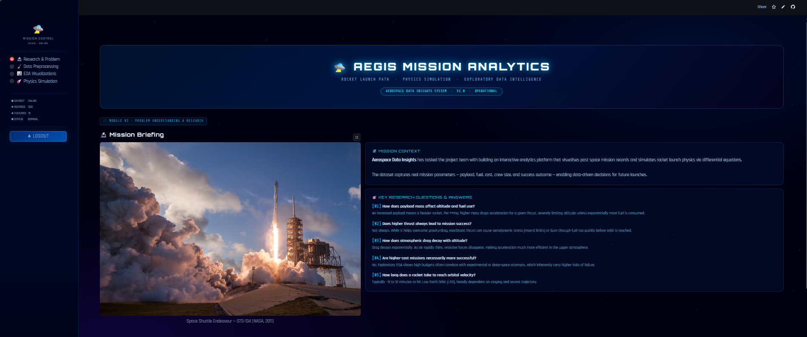
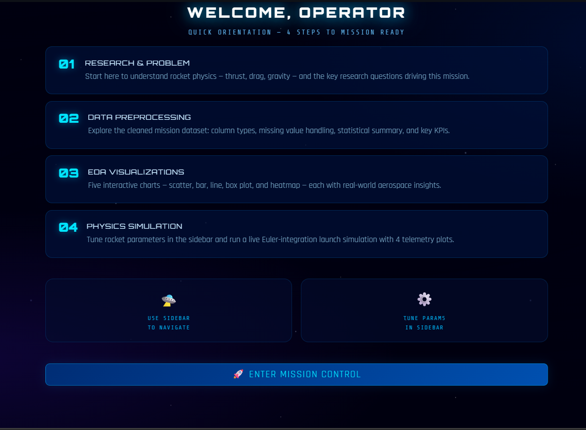

# Space Mission Launch Path Explorer

**Student Name:** Aditya Jitendra Kumar Sahani  
**Student ID:** 1000414  
**Course:** Artificial Intelligence  
**Focus:** Mathematics for AI-I
**Assessment Type:** Submative Assessment  (SA)  

## Project overview

This project presents an interactive **Space Mission Launch Path Explorer**, developed using **Streamlit**, to analyze and simulate real-world rocket missions. The application visualizes **500 historical space mission records** and applies mathematical concepts used in Artificial Intelligence, including **Newton's Second Law**, **correlation analysis**, and **numerical simulation using differential equations**.

The dashboard allows users to explore relationships between mission parameters such as payload mass, fuel consumption, mission cost, crew size, launch vehicle type, and mission success rate. Through interactive visualizations and a physics-based rocket launch simulator, users can observe how different variables influence mission outcomes.

The project follows the **Scenario 1: Rocket Launch Path Visualization** approach, replicating real-world workflows used in aerospace data analysis and mission planning. It integrates data science techniques with physical simulation models to provide both analytical insights and practical demonstrations of rocket dynamics.

The application also includes an **Euler-based physics simulation engine** that numerically calculates rocket altitude, velocity, and acceleration over time while considering thrust, gravity, aerodynamic drag, and decreasing rocket mass during fuel burn.

Overall, this project demonstrates how mathematical modeling, data visualization, and AI-oriented analytical tools can be combined to better understand space mission performance.

| | |
|:---:|:---:|
|  **Dashboard** |  **Mission Intelligence Dashboard** |

---

## Live web app/dashboard streamlit cloud link

The interactive dashboard can be accessed through the following Streamlit Cloud deployment link:

> **🔗 [Click here to open the live Streamlit app](https://idai104-1000414-aditya-jitendra-kumar-sahani-sa.streamlit.app/)**

The web application allows users to:

- Explore mission datasets
- Analyze relationships between payload, fuel, and cost
- Visualize statistical patterns through interactive charts
- Run a real-time rocket launch simulation based on adjustable parameters

The deployment ensures that the application can be accessed directly from a browser without local installation, providing a fully interactive analytical experience.

---

## What Does This App Visualise?

| Section | Visualisations |
|---|---|
| 📊 Overview & EDA | Box Plot (Success by Mission Type), Bar Chart (Launch Vehicles), Correlation Heatmap |
| 🔥 Fuel & Payload | Scatter Plot (Payload vs Fuel), Scatter + Trendline (Distance vs Duration), Bar (Fuel Efficiency) |
| 💰 Cost Analysis | Scatter (Cost vs Success), Bar (Avg Cost by Category), Line Plot (Scientific Yield over Time) |
| 🛸 Simulation | Live Rocket Launch Simulation using differential equations (altitude, velocity, acceleration) |
| 🧠 Insights & Report | Key findings, Dataset Explorer, Mission Type Distribution Pie Chart |

---

## Research Context — Newton's Second Law Applied

**Research Questions & Answers for Mission Planning:**

**Q: What do thrust, drag, and payload mean in real missions?**
*   **Thrust:** The force generated by the rocket's engines to push it upward, overcoming Earth's gravity.
*   **Drag:** The aerodynamic resistance the rocket experiences as it moves through the atmosphere.
*   **Payload:** The cargo the rocket carries (e.g., satellites, spacecraft, astronauts).

**Q: How does adding more payload affect altitude?**
*   Adding more payload increases the total mass of the rocket. According to Newton's Second Law ($F = m \times a$), for a constant thrust, an increase in mass results in lower acceleration, meaning the rocket will reach a lower altitude given the same amount of fuel.

**Q: How does increasing thrust affect launch success?**
*   Increasing thrust provides a higher net upward force, allowing the rocket to overcome gravity and aerodynamic drag more effectively. This improves acceleration and increases the probability of reaching the required orbital velocity and altitude.

**Q: Does lower drag at higher altitudes improve speed?**
*   Yes. As altitude increases, atmospheric density decreases rapidly, resulting in less drag. With less resistive force, more of the thrust contributes directly to acceleration, rapidly improving the rocket's speed.

**Q: How long would it take to reach orbit?**
*   This depends on the rocket and target orbit, but typically it takes a rocket about 8 to 12 minutes to reach Low Earth Orbit (LEO).

**Q: Can I compare simulation values to real mission data?**
*   Yes, simulation parameters such as max altitude, velocity at engine cutoff, and time to orbit can be benchmarked against historical telemetry data from real missions (like SpaceX Falcon 9) to validate the model's accuracy.

Rockets follow **F = ma**, where:
- **Thrust** (engine force, upward) 
- **Gravity** = mass × 9.81 m/s² (downward)  
- **Drag** = air resistance (decreases at altitude as air gets thinner)
- As **fuel burns → mass decreases → acceleration increases**

**Differential equation used in simulation:**
```
a(t) = [Thrust − m(t)×g − 0.5×Cd×ρ(h)×v(t)²×A] / m(t)
v(t+1) = v(t) + a(t) × Δt
h(t+1) = h(t) + v(t) × Δt
m(t+1) = m(t) − fuel_burn_rate × Δt
```

---

## User Interface (UI) Features

The AEGIS Mission Control Dashboard includes several interactive modules:

- **Login & Onboarding**: A secure entry point with terms of service, leading into an interactive 4-step onboarding briefing.
- **Research & Problem**: Contextual explanations of rocket physics (Thrust, Weight, Drag) and real-world aerospace queries.
- **Data Preprocessing**: Displays raw telemetry data, column diagnostics, statistical summaries, and cleaning pipeline logs.
- **EDA Visualizations**: Interactive Plotly charts (Scatter, Bar, Line, Heatmap) analyzing correlations between payload, fuel, cost, and mission success.
- **Physics Simulation Engine**: A live numeric Euler-integration simulator modeling launch trajectories based on varying physical parameters, complete with visual telemetry output.

| | |
|:---:|:---:|
|  **Login Screen** |  **Terms & Conditions** |
|  **Onboarding** |  **Dashboard** |

## Integration details

The application integrates data analysis, physics modeling, and visualization technologies to create an interactive analytical environment.

### Data Integration

The dataset containing 500 real-world space mission records is loaded using the **Pandas** library. The application performs preprocessing steps such as:

- Handling missing values
- Converting data types
- Parsing mission dates
- Preparing numerical columns for analysis

This processed dataset is then used for statistical exploration and visualization.

| | |
|:---:|:---:|
|  **Data Preparation** |  **Cleaning Pipeline** |

### Physics Integration

The core physics engine simulates rocket motion using **Newton's Second Law of Motion (F = ma)**. The system models the rocket's acceleration by accounting for three major forces:

- **Thrust** generated by the rocket engines
- **Gravitational force** acting downward
- **Aerodynamic drag** caused by atmospheric resistance

The motion equations are solved numerically using the **Euler integration method**, updating velocity, altitude, and mass at small time intervals. This allows the application to simulate realistic rocket launch trajectories.

| | |
|:---:|:---:|
|  **Core Physics Engine** |  **Physics Simulation Engine** |
|  **Simulation Parameters** |  **Flight Parameter Visualization** |

### Visualization Integration

The dashboard integrates multiple visualization libraries:

- **Plotly** for interactive charts (scatter plots, bar charts, line charts)
- **Seaborn** and **Matplotlib** for statistical heatmaps and supporting visualizations
- **Streamlit** layout components for responsive dashboards

These visualizations help users explore patterns such as fuel efficiency, mission cost relationships, and payload impact on mission success.

| | |
|:---:|:---:|
|  **Scatter Plot Graph** |  **Bar Chart Graph** |
|  **Heatmap** |  **Mission Intelligence Dashboard** |

---

## Repository Structure

```
📦 IDAI104-1000414-ADITYA-JITENDRA-KUMAR-SAHANI-SA
├── app.py                          # Main Streamlit application
├── requirements.txt                # Python dependencies
├── space_missions_dataset__1_.csv  # Dataset (500 missions)
└── README.md                       # This file
```

---

## How to Run Locally

```bash
# 1. Clone this repository
git clone https://github.com/IDAI104-1000414-ADITYA-JITENDRA-KUMAR-SAHANI-SA
cd IDAI104-1000414-ADITYA-JITENDRA-KUMAR-SAHANI-SA

# 2. Install dependencies
pip install -r requirements.txt

# 3. Run the app
streamlit run app.py
```

---

## Deployment instructions

The application can be deployed using **Streamlit Cloud**, allowing users to access the dashboard through a web browser without installing any software.

### Steps to Deploy

1. Push all project files to a **GitHub repository**.
2. Visit the [Streamlit Cloud platform](https://streamlit.io/cloud).
3. Sign in using your **GitHub account**.
4. Click **"Deploy an App"**.
5. Select your repository containing the project.
6. Choose `app.py` as the main application file.
7. Click **Deploy**.

After deployment, Streamlit automatically builds the environment using the `requirements.txt` file and generates a public web application link.

This live deployment allows the dashboard to run on cloud infrastructure and makes the project accessible from any device.

---

## Key Insights from the Data

1. **Heavier Payloads → More Fuel Consumed** — Confirms Newton's Second Law: greater mass requires greater thrust and fuel.
2. **High Cost ≠ High Success** — No strong correlation between mission budget and success rate.
3. **Distance Drives Duration** — Farther targets require proportionally longer missions and more fuel.
4. **Launch Vehicle Matters** — Starship handles heavier payloads; Falcon Heavy excels in fuel efficiency.
5. **Research Missions Deliver Most Scientific Value** — Highest average scientific yield across all mission types.

---

## Technologies Used

| Tool | Purpose |
|---|---|
| `Streamlit` | Interactive web dashboard |
| `Pandas` | Data loading, cleaning & analysis |
| `NumPy` | Numerical simulation (differential equations) |
| `Plotly` | Interactive charts (scatter, bar, box, line) |
| `Seaborn` | Statistical heatmap & line plots |
| `Matplotlib` | Supporting static charts |
| `Statsmodels` | Trendline (OLS regression) in scatter plots |

---

## Assessment Checklist

- [x] Problem Understanding & Research (Newton's Law, rocket dynamics)
- [x] Data Preprocessing & Cleaning (date conversion, type casting, null handling)
- [x] 5+ Compulsory Visualisations (scatter, bar, line, box, heatmap)
- [x] Rocket Launch Simulation (differential equations, step-by-step)
- [x] Interactive Streamlit controls (sliders, dropdowns, multiselects)
- [x] GitHub Repository with README & requirements.txt
- [x] Streamlit Cloud Deployment

---


*🌌 Aerospace Data Insights | Mathematics for AI-I Summative Assessment*